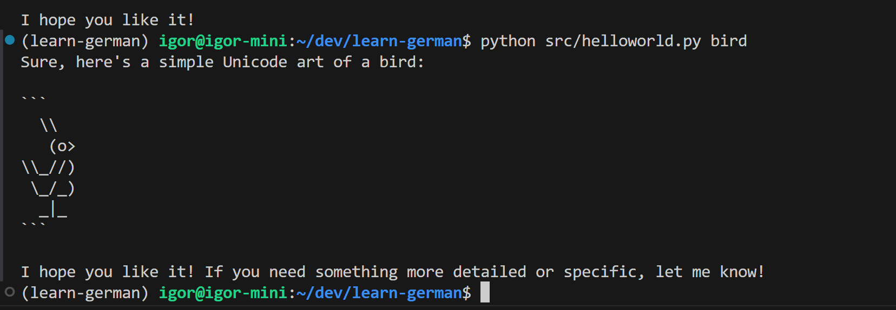

# learn-german



# Environment setup

- Install dependencies required for python ([source](https://github.com/pyenv/pyenv/wiki#suggested-build-environment)):

```bash
sudo apt-get update && sudo apt-get install build-essential libssl-dev zlib1g-dev libbz2-dev libreadline-dev libsqlite3-dev curl git libncursesw5-dev xz-utils tk-dev libxml2-dev libxmlsec1-dev libffi-dev liblzma-dev
```

- Install pyenv ([source](https://github.com/pyenv/pyenv-installer?tab=readme-ov-file#install)):

`curl https://pyenv.run | bash`

- Update .bashrc:

```bash
echo -e 'export PYENV_ROOT="$HOME/.pyenv"\nexport PATH="$PYENV_ROOT/bin:$PATH"' >> ~/.bashrc
echo -e 'eval "$(pyenv init -)"\neval "$(pyenv virtualenv-init -)"' >> ~/.bashrc
```

- Set up OpenAI token using https://platform.openai.com/api-keys:

`echo -e 'export OPEN_API_TOKEN="YOUR OPEN API TOKEN"' >> .env`

- Refresh shell:

`exec "$SHELL"`

- Install dependencies:

`scripts/install_dependencies.sh`

- Execute:

`python ./src/helloworld.py "Your query"`
